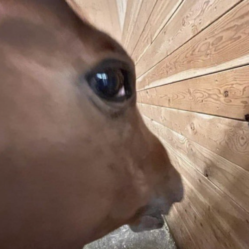

## Aurelian Silva for DiffSinger

Galloping onto the runway.  

***
## Summary
Aurelian Silva for DiffSinger is an AI Singer utilizing the DiffSinger engine through OpenUTAU! He has a youthful, masculine, voice with a British accent and can sing in English, Japanese, Chinese, Korean, French, Spanish and Thai! (Plus many more through phoneme manipulation!)

***

## Character information
- Gender: Male
- Height: 2m
- Weight: 500 kg
- Age: 25
- Optimal Range: F2 - A5

***

## Notes
This voicebank was trained with the "Multi-Dict" branch of DiffSinger. This is supported by the current beta of OpenUTAU. The following is a list of language tags used by "Aurelian Silva for DiffSinger":

| Language | Tag |
| :----- | ---: |
| English | en/ |
| Japanese | ja/ |
| Chinese | zh/ |
| Korean | ko/ |
| French | fr/ |
| Spanish | es/ |
| Thai | th/ |

As well as the language tags there are a few extra phonemes available to use across all languages:

| Phoneme | Name | Usage |
| :----- | --- | ---: |
| SP | Silence | Denotes silent pauses |
| AP | Breaths | Denotes pauses with an intake of breath |
| cl | Plosive Modifier | This can be used after consonants to reign in their pronunciation a bit. |
| q | Glottal Stop | uh-oh [ah q ow] |
| vf | Vocal Fry | This can be added before vowels, and some consonants, paired with a low pitch curve/point, to add vocal fry |

The following phonemes are extras for the English language natively supported by the upcoming "DIFFS-EN+" phonemizer.

| Phoneme | Type | Usage |
| :----- | --- | ---: |
| ax | Vowel | again [**ax** g eh n] |
| dr | Consonant | dream [**dr** iy m] |
| tr | Consonant | train [**tr** ey n] |

The Thai language works through the regular "DIFFS" phonemizer as, as far as I'm aware, there isn't one specifically for Thai yet and French requires the Millefeuille DIFFS-FR phonemizer found on their website (linked below!).

***

## Credits
This voicebank was trained alongside the following corpora:
- Millefeuille for French support (https://utaufrance.com/millefeuille-diffsinger/)
- Namine Criss Spanish Dataset by CrissZ3R0VZ for Spanish support
- PJS Corpus for Japanese Support (https://sites.google.com/site/shinnosuketakamichi/research-topics/pjs_corpus)
	- Labels by UtaUtaUtau, edited by tigermeat
- Thai datasets for Thai Support (https://thaids.printmov.com/)
- Various datasets by TigerMeat for Chinese and Korean support
- Project AI❤dol Public English Dataset (https://github.com/lottev1991/Project-AIdol-Public-English-Dataset) 

This voicebank also utilises the "tgm_hifigan v107" vocoder, trained by TigerMeat, as it contains all of Aurelian's current data in the dataset used to train it. This allows for better replication of Aurelian's voice.

